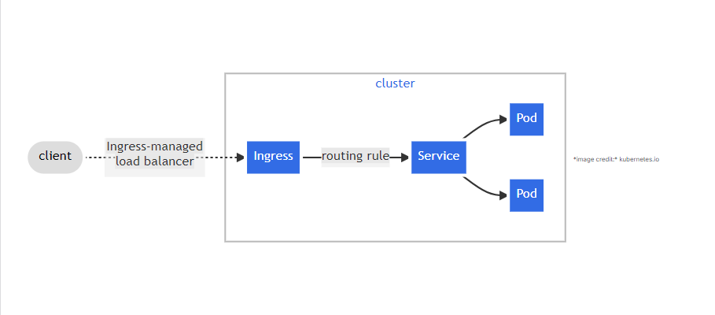

#### Deploying and Packaging applications into Kubernetes with Helm
##### A Jfrog Artifactory  set up as a private registry for an organisation's Docker images and Helm charts

In [Jenkins deploy](https://github.com/Johnstx/Deploying-Jenkins-into-an-EKS-cluster-with-HELM.git), HELM was used as a useful tool to deploy a Devops tool to a kubernetes cluster.
Lets explore use of HELM to do same to more Devops tools
This project applies the same principle to deploy Artifactory into an EKS cluster.

This projects creates a realistic experience encountered when deploying applications using HELM such as fixing  deployment issues, tweaking helm values files to automate the application deployment etc.

<!-- *NB: Check [here](https://github.com/Johnstx/Deploying-Jenkins-into-an-EKS-cluster-with-HELM.git) for introduction to the use of helm* -->


**The Core focus** - 
1. Artifactory
2. Ingress controllers
3. Cert-manager.

Other DevOps tools that many be deployed with HELM include
Prometheus
Grafana
Elasticsearch ELK using ECK


Artifactory is part of a suit of products from a company called Jfrog. Jfrog started out as an artifact repository where software binaries in different formats are stored. Today, Jfrog has transitioned from an artifact repository to a DevOps Platform that includes CI and CD capabilities. This has been achieved by offering more products in which Jfrog Artifactory is part of. Other offerings include

JFrog Pipelines -  a CI-CD product that works well with its Artifactory repository. Think of this product as an alternative to Jenkins.
JFrog Xray - a security product that can be built-into various steps within a JFrog pipeline. Its job is to scan for security vulnerabilities in the stored artifacts. It is able to scan all dependent code.


### The Objective

**In this project**, the objective is to use Jfrog Artifactory as a private registry for an organisation's Docker images and Helm charts. This requirement will satisfy part of the company's corporate security policies to never download artifacts directly from the public into production systems. We will eventually have a CI pipeline that initially pulls public docker images and helm charts from the internet, store in artifactory and scan the artifacts for security vulnerabilities before deploying into the corporate infrastructure. 

**Deploy Jfrog Artifactory into Kubernetes**

First, lets set up the Kubernetes cluster.

1. Create the cluster
```
eksctl create cluster --name staxx-tooling-app --region us-west-1 --nodegroup-name worker --node-type t3.xlarge --nodes 2
```
Then update the kubeconfig file with the new cluster created
```
aws eks update-kubeconfig --name staxx-tooling-app --region us-west-1
```
Create a namespace thst will set your work environment for the group of DevOps apps to be deployed. Lets create a namespace called ```dev```

```
kubectl create ns dev
```

This project will require data creating and attaching volumes as well as data persistence in pods. To achieve this,EBS volume will be used for storage. However, Kubernetes by default does not have connectivity to the EBS, to enable this connectivity, we will install a driver, **EBS-CSI diver.**


The **EBS CSI Driver** (Amazon Elastic Block Store Container Storage Interface Driver) is a crucial component in Kubernetes environments for managing Amazon Elastic Block Store (EBS) volumes. The CSI (Container Storage Interface) is a standard API that allows Kubernetes and other container orchestrators to manage storage systems. With the EBS CSI driver, Kubernetes can provision, attach, and manage EBS volumes directly within a Kubernetes cluster.

**Some Key Features of EBS CSI Driver**

**Dynamic Volume Provisioning**:
Automatically creates EBS volumes when Kubernetes PersistentVolumeClaims (PVCs) are created, without manual intervention.

**Volume Attach/Detach:**
Attaches the volume to the correct EC2 node and makes it available for the pod to use.
Detaches volumes when no longer needed, ensuring efficient resource use.

**Volume Resizing:**
Allows you to increase the size of the EBS volume without disrupting your workload, which is useful when workloads require more space.

**Snapshots**:
Supports taking snapshots of volumes for backup or cloning purposes.
Can be used to create new volumes from snapshots, which is useful for disaster recovery or scaling.

**Volume Cloning:**
Supports creating clones of EBS volumes, enabling fast provisioning of new volumes for development or testing.

**Availability & High Availability:**
Designed to work with EC2 instances across different availability zones, providing fault tolerance by ensuring volumes are attached to the correct nodes in the cluster.


**Installing EBS CSI Driver**

1. List the items in the **kube-system** namespace.

```
kubectl get pods -n kube-system
```


Observe the pods running on the *kube-dns* namespace. Afer the ebs-csi install, its pods will also run on this namespace.

To Install the **EBS CSI** check this [AWS walkthrough](https://docs.aws.amazon.com/eks/latest/userguide/managing-ebs-csi.html).

2, To see the required platform version, run the following command.
```
aws eks describe-addon-versions --addon-name aws-ebs-csi-driver
```


Check if cluster has an  [OpenID Connect (OIDC )](https://openid.net/connect/) issuer associated with it.
To use AWS Identity and Access Management (IAM) roles for service accounts, an IAM OIDC provider must exist for your cluster’s OIDC issuer URL.

You can create an IAM OIDC provider for your cluster using eksctl or the AWS Management Console.

2. **Create OIDC provider (eksctl)**

i. Determine the OIDC issuer ID for your cluster.

Retrieve your cluster’s OIDC issuer ID and store it in a variable. Replace *staxx-tooling-app* with your own value.

```
cluster_name=staxx-tooling-app
```

```
oidc_id=$(aws eks describe-cluster --name $cluster_name --query "cluster.identity.oidc.issuer" --output text | cut -d '/' -f 5)
```
```
echo $oidc_id
```


ii. Determine whether an IAM OIDC provider with your cluster’s issuer ID is already in your account.

```
aws iam list-open-id-connect-providers | grep $oidc_id | cut -d "/" -f4
```
If output is returned, then you already have an IAM OIDC provider for your cluster and you can skip the next step. If no output is returned, then you must create an IAM OIDC provider for your cluster.


If theres no return, then follow through with below:

Create an IAM OIDC identity provider for your cluster with the following command.
```
eksctl utils associate-iam-oidc-provider --cluster $cluster_name --region us-west-1 --approve
```


**Assign IAM roles to Kubernetes service accounts**.

Now we configure a Kubernetes service account to assume an AWS Identity and Access Management (IAM) role. Any Pods that are configured to use the service account can then access any AWS service that the role has permissions to access.

**Create an IAM role and policy and link to the k8s cluster**
STEPS
1. Create an IAM role: while creating an IAM role. An assume policy has to be specified in the role as an arguement, therefore create the assume-role-policy first before creating the IAM role.
2. create an assume role policy, then proceed to number 1.
3. Create a role policy for the IAM role created above.
4. Create the EBS CSI driver add-on


**The Role Policy**
Create a file aws-ebs-csi-driver-trust-policy.json that includes the permissions for the AWS services

```
cat >aws-ebs-csi-driver-trust-policy.json <<EOF
{
      "Version": "2012-10-17",
      "Statement": [
        {
          "Effect": "Allow",
          "Principal": {
            "Federated": "arn:aws:iam::619071319479:oidc-provider/oidc.eks.us-west-1.amazonaws.com/id/$oidc_id"
          },
          "Action": "sts:AssumeRoleWithWebIdentity",
          "Condition": {
            "StringEquals": {
              "oidc.eks.us-west-1.amazonaws.com/id/$oidc_id:aud": "sts.amazonaws.com",
              "oidc.eks.us-west-1.amazonaws.com/id/$oidc_id:sub": "system:serviceaccount:kube-system:ebs-csi-controller-sa"
            }
          }
        }
      ]
}
EOF
```


**The IAM Policy**

```
aws iam create-role \
      --role-name AmazonEKS_EBS_CSI_DriverRole \
      --assume-role-policy-document file://"aws-ebs-csi-driver-trust-policy.json"

```


**The Role Policy**
```
aws iam attach-role-policy \
      --policy-arn arn:aws:iam::aws:policy/service-role/AmazonEBSCSIDriverPolicy \
      --role-name AmazonEKS_EBS_CSI_DriverRole
```


**The EBS CSI add-on**

Run the command below - 
```
aws eks create-addon --cluster-name $cluster_name --addon-name aws-ebs-csi-driver \
  --service-account-role-arn arn:aws:iam::619071319479:role/AmazonEKS_EBS_CSI_DriverRole --region us-west-1
```


Check the kube-system namespace and view the pods added.

```
kubectl get pods -n kube-system
```


#### Deploy Tools in Kubernetes

**Artifactory**
The best approach to easily get Artifactory into kubernetes is to use helm.

1. Search for an official helm chart for Artifactory on [Artifact Hub](https://artifacthub.io/)

2. Add the jfrog remote repository on your PC
```
helm repo add jfrog https://charts.jfrog.io
``` 

3. Create a namespace ```tools``` where all DevOps tools will be deployed.
```
kubectl create ns tools
```
4. Update the helm repo index
```
helm repo update
```

5. Install artifactory

```
helm upgrade --install artifactory jfrog/artifactory --version 107.38.10 -n tools
```


**NB**

* We have used upgrade --install flag here instead of helm install artifactory jfrog/artifactory This is a better practice, especially when developing CI pipelines for helm deployments. It ensures that helm does an upgrade if there is an existing installation. But if there isn't, it does the initial install. With this strategy, the command will never fail. It will be smart enough to determine if an upgrade or fresh installation is required.

* The helm chart version to install is very important to specify. So, the version at the time of writing may be different from what you will see from Artifact Hub. So, replace the version number to the desired. You can see all the versions by clicking on "see all" as shown in the image below.

Check the output from the installation for some next step directives.

#### Getting the Artifactory URL

Lets break down the first Next Step.


1. The artifactory helm chart comes bundled with the Artifactory software, a PostgreSQL database and an Nginx proxy which it uses to configure routes to the different capabilities of Artifactory. Getting the pods after some time, you should see something like the below.


2. Each of the deployed application have their respective services. This is how you will be able to reach either of them.


3. Notice that, the Nginx Proxy has been configured to use the service type of LoadBalancer. Therefore, to reach Artifactory, we will need to go through the Nginx proxy's service. Which happens to be a load balancer created in the cloud provider. Run the kubectl command to retrieve the Load Balancer URL.

```
kubectl get svc artifactory-artifactory-nginx -n tools
```

4. Copy the URL and paste in the browser
 
 
 
 5. The default username is admin
The default password is password

**How the Nginx URL for Artifactory is configured in Kubernetes**

Helm uses the **values.yaml** file to set every single configuration that the chart has the capability to configure. THe best place to get started with an off the shelve chart from artifacthub.io is to get familiar with the **DEFAULT VALUES**

* To work directly with the **values.yaml** file, you can download the file locally by clicking on the download icon.

**Is the Load Balancer Service type the Ideal configuration option to use in the Real World?**

Setting the service type to **Load Balance**r is the easiest way to get started with exposing applications running in kubernetes externally. But provissioning load balancers for each application can become very expensive over time, and more difficult to manage. Especially when tens or even hundreds of applications are deployed.
The best approach is to use [Kubernetes Ingress](https://kubernetes.io/docs/concepts/services-networking/ingress/) instead. But to do that, we will have to deploy an [Ingress Controller](https://kubernetes.io/docs/concepts/services-networking/ingress-controllers/).

A huge benefit of using the ingress controller is that we will be able to use a single load balancer for different applications we deploy. Therefore, Artifactory and any other tools can reuse the same load balancer. Which reduces cloud cost, and overhead of managing multiple load balancers. more on that later.

For now, we will leave artifactory, move on to the next phase of configuration (Ingress, DNS(Route53) and Cert Manager), and then return to Artifactory to complete the setup so that it can serve as a private docker registry and repository for private helm charts


**Deploying Ingress Controller and managing Ingress Resources**
Lets highlight the Ingress resource first

**An Ingress resource** in Kubernetes is an API object that manages external access to services within a cluster, typically using HTTP and HTTPS. It provides routing rules to expose services based on hostnames, paths, or other configurations.

Below shows how ingress sends traffic to a service.


*image credit:* kubernetes.io
An ingress resource for Artifactory would like like below

